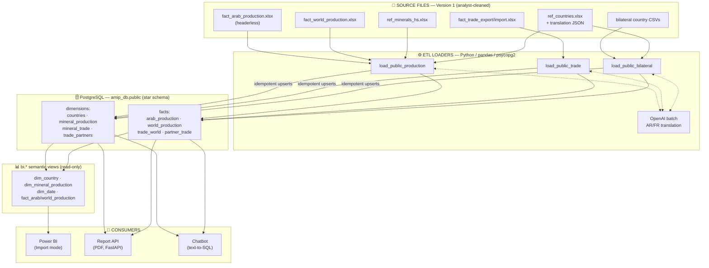
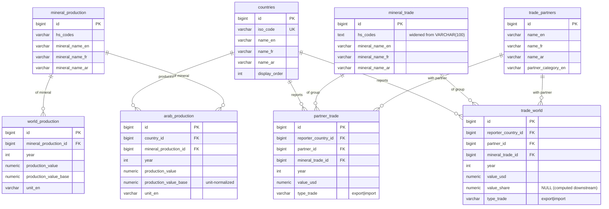
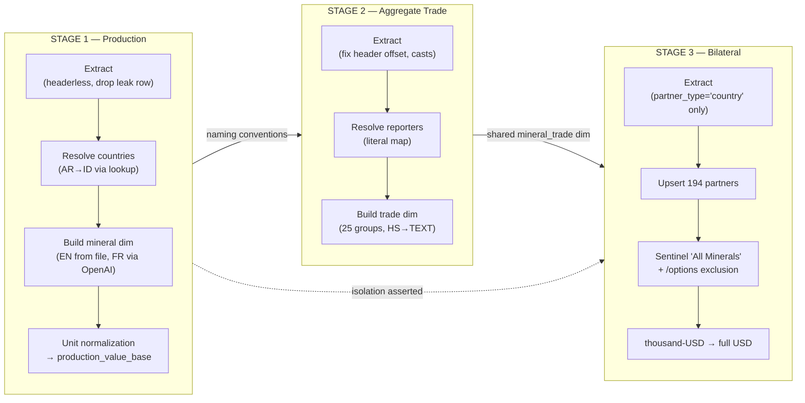
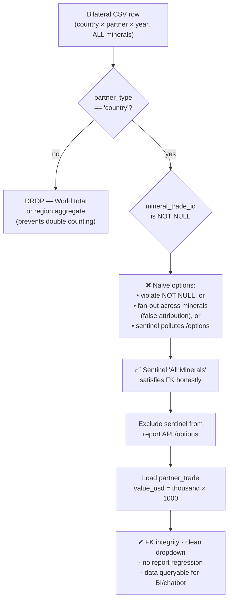
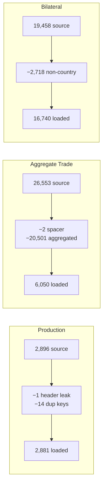
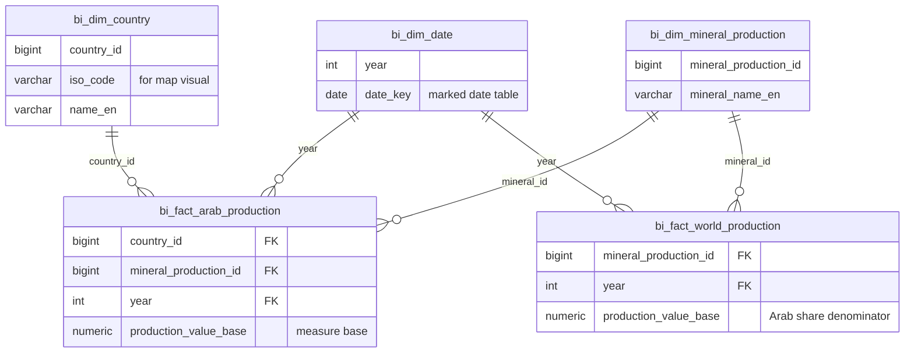

# Data Engineering — Visual Diagrams

Mermaid diagrams for the AMIP data engineering work. These render natively on
GitHub, VS Code (with a Mermaid extension), Notion, Obsidian, and most slide
tools. To export an image: open in any Mermaid live editor
(https://mermaid.live), paste a block, and download as SVG/PNG.

---

## 1. End-to-End Data Flow (architecture)

---

## 2. Star Schema (entity-relationship diagram)

---

## 3. ETL Pipeline Stages (sequence & dependencies)

---

## 4. The Bilateral Grain-Mismatch Decision (headline engineering challenge)

---

## 5. Data Quality Funnel (rows in → rows loaded)

---

## 6. Power BI Semantic Model (production)

